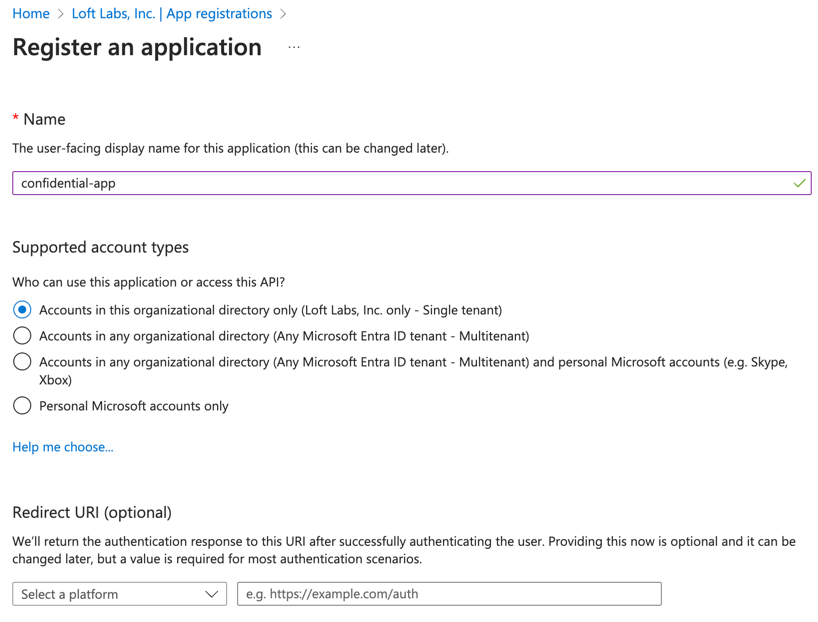
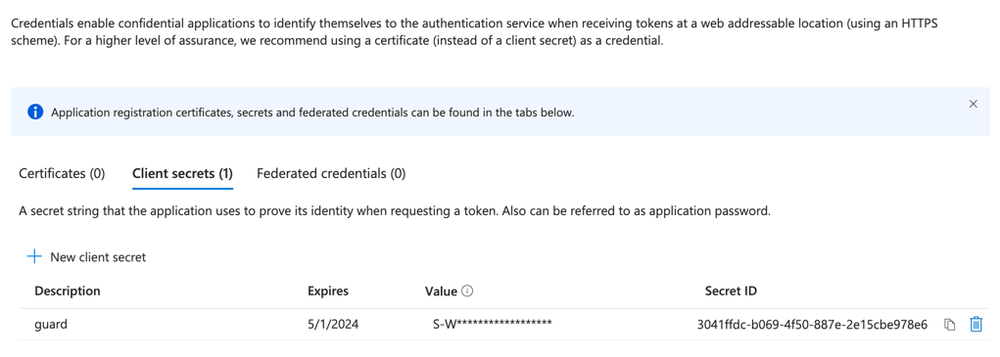
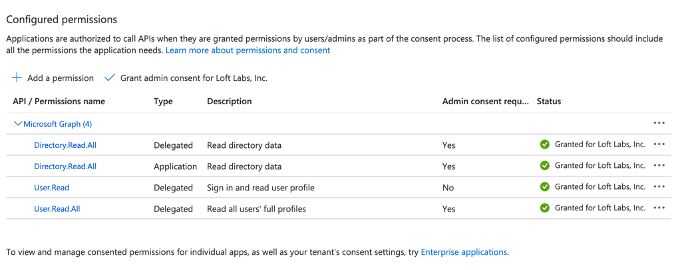
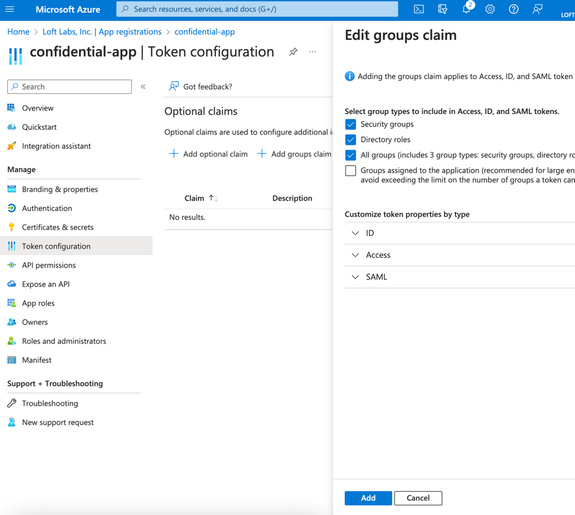
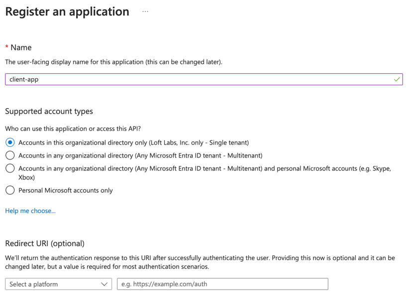
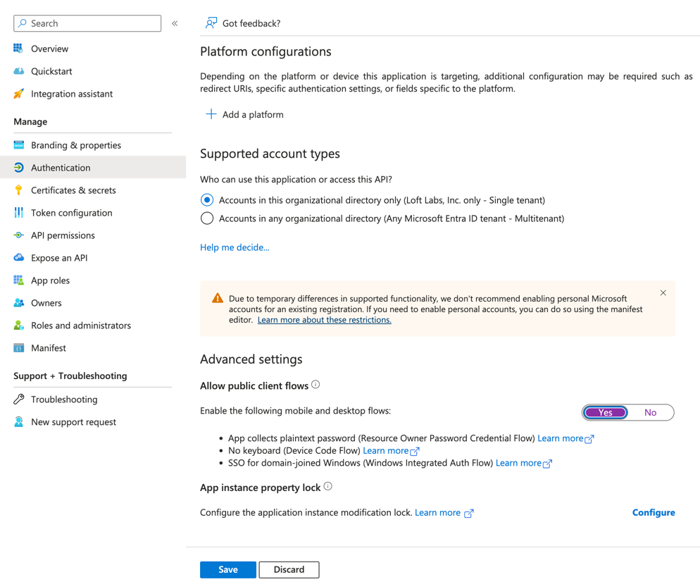
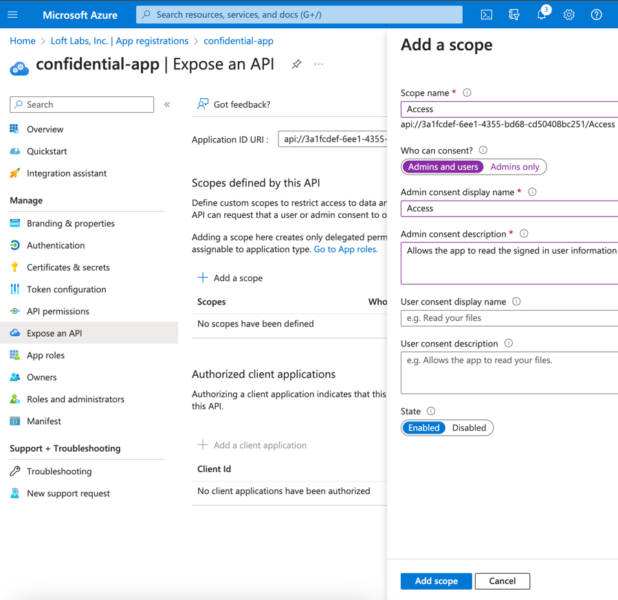
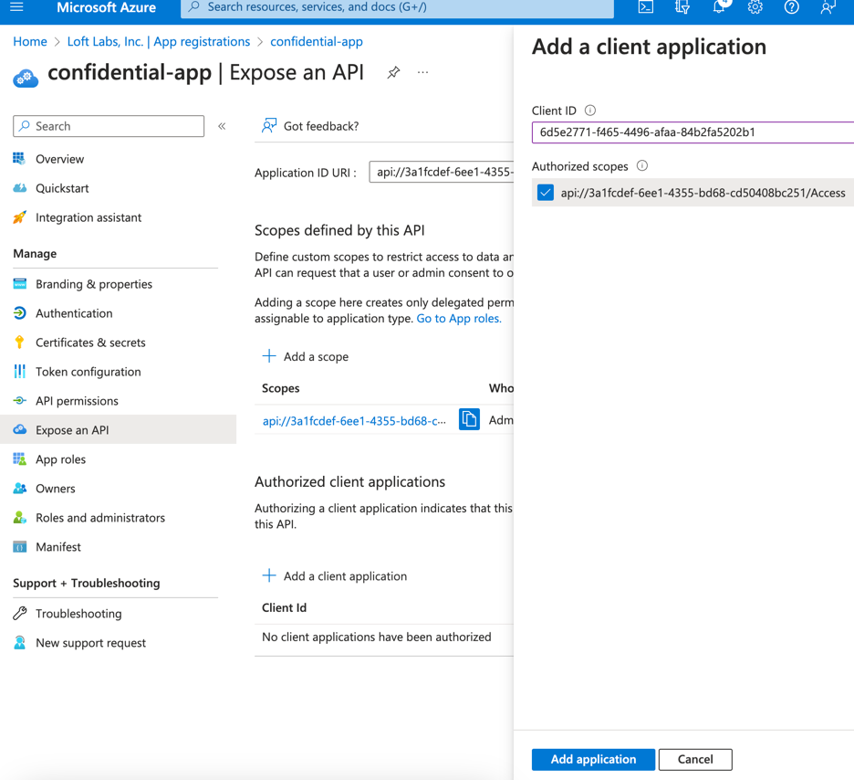
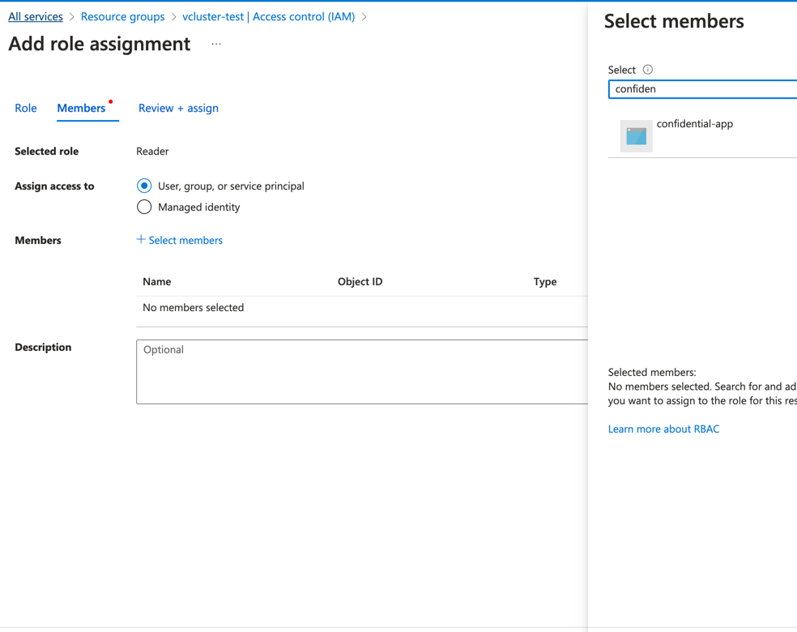

## vCluster.Pro Azure RBAC Demo

This example repository shows how to use [Azure RBAC](https://learn.microsoft.com/en-us/azure/role-based-access-control/overview) together with [vCluster.Pro](https://www.vcluster.com/pro/).

## Preface

The way this works is by installing [guard](https://github.com/loft-sh/guard) into the host cluster and connecting the created vClusters to it, by configuring the [Authentication Webhook](https://kubernetes.io/docs/reference/access-authn-authz/authentication/#webhook-token-authentication) as well as [Authorization Webhook](https://kubernetes.io/docs/reference/access-authn-authz/webhook/) on the vCluster api server.
To control access on the Azure side, we create empty [Azure Resource Groups](https://learn.microsoft.com/en-us/azure/azure-resource-manager/management/manage-resource-groups-portal#create-resource-groups) that map to a single guard instance, which in return serve one to many vClusters. On these empty resource groups we can then assign users and groups to map Azure RBAC roles to the vClusters.

## Setting up Azure

### 0. Configure Private Host AKS Cluster (Optional)

If you are not using a private AKS cluster, this step is optional.

If using a private AKS Cluster as the host cluster, make sure the following addresses are routable within the private AKS cluster:
* https://login.microsoftonline.com: Used to validate login credentials against
* https://sts.windows.net: Retrieve guard OIDC token for application
* https://management.azure.com: Validate Azure RBAC permissions

In addition, make sure the following images can be pulled within the cluster (besides the [vCluster.Pro images](https://github.com/loft-sh/loft/releases/latest/download/loft-images.txt)):
* ghcr.io/loft-sh/guard:v0.16.3-loft.2

### 1. Create First Application (confidential-app)

Go to `Microsoft Entra ID` > `App registrations` and create a new app called `confidential-app`. 



Note down the **Application (client) ID** as `<application-id>`. 

Next navigate to `Certificates & secrets` and create a new **Client Secret**:



Note down the **Value** as `<application-secret>`.

Next navigate to `API permissions` add the following permissions to the app:



Make sure to click the `Grant admin consent for ORGANISATION` to enable the permissions for everyone.

Next navigate to `Token configuration` and click on `Add groups claim`:



### 2. Create Second Application (client-app)

We need a second application for the users to login, while the first (`confidential-app`) is used for the guard deployment. This follows best-practices of the [Microsoft Identity Platform](https://learn.microsoft.com/en-us/entra/identity-platform/authentication-flows-app-scenarios). 

Go to `Microsoft Entra ID` > `App registrations` and create a new app called `client-app`.



Note down the **Application (client) ID** as `<client-id>`. 

Next navigate to `Authentication` and enable `Allow public client flows`:



Next navigate to `Token configuration` and click on `Add groups claim`:


### 3. Add confidential-app access to client-app

Navigate back to app `confidential-app` and click on `Expose an API`, then click on `Add` under **Application ID URI** at the top. Make sure the **Application ID URI** looks like `api://<application-id>` and press `Save`.

Next click on `Add a scope`:



Next press `Add a client application` and paste the `<client-id>` under **Client ID**:



Make sure to **select all authorized scopes**.

### 4. Create vCluster Resource Group

Next we create a placeholder resource group for our vClusters. This resource group will be used to validate Azure RBAC roles against. You can assign users & groups to it to allow access for these vClusters. Each guard deployment will map exactly to one resource group. You can use a single resource group to manage access to many vClusters or one resource group per vCluster, which means you will need to deploy one guard deployment per vCluster in the underlying host Kubernetes cluster.

Navigate to `Resource Groups` and press `Create`. Choose a subscription, resource group name and press `Review + create`.

Under `Overview` click on `JSON View` and note down the `Resource ID` as `<resource-group-id>`. This should look like `/subscriptions/<subscription-id>/resourceGroups/<resource-group-name>`.

Next click on `Access control (IAM)` and click on `Add` and select `Role assignment`. Select `Reader` as a role and under members add `confidential-app`:



Then press 'Review + assign'.

For each user or group that should be able to access the vClusters, assign one of the Kubernetes arc roles, such as `Azure Arc Kubernetes Cluster Admin`.

## Deploy Guard into Host Kubernetes cluster

For this section we assume to install a single guard instance into namespace `kube-system`. The guard instance will be available through cluster dns at `https://guard.kube-system:443`

### 1. Install guard CLI & generate certificates

Download the latest guard version at https://github.com/loft-sh/guard/releases/latest and place the binary in your path.

Next we need to generate the needed certificates for guard:

```
guard init ca
guard init server --domains guard.kube-system
```

### 2. Generate Install Manifests

Next we create the Kubernetes manifests for installing guard:
```
# confidential-app id
APPLICATION_ID=<application-id>
# confidential-app id secret
APPLICATION_SECRET=<application-secret>
# tenant id
TENANT_ID=<tenant-id>
# Kubernetes fleet id in the form of /subscriptions/...
RESOURCE_GROUP_ID=<resource-group-id>

# Create the manifests via client-secret
guard get installer \
   --auth-providers=azure \
   --azure.auth-mode=client-credential \
   --azure.client-id=$APPLICATION_ID \
   --azure.client-secret=$APPLICATION_SECRET \
   --azure.tenant-id=$TENANT_ID \
   --azure.verify-clientID \
   --authz-providers=azure \
   --azure.authz-mode=arc \
   --azure.skip-authz-namespace \
   --azure.resource-id=$RESOURCE_GROUP_ID \
   --azure.skip-authz-for-non-aad-users=true \
   --azure.allow-nonres-discovery-path-access=true > installer.yaml
```

> Use `--azure.client-assertion=$JWT_TOKEN` instead of `--azure.client-secret` to use a client certificate instead of a client secret

Next we need to modify the generated yaml to avoid problems when deploying guard:
* Remove `Service.spec.clusterIP`
* Remove `Deployment.spec.template.spec.nodeSelector`
* Remove `Deployment.spec.template.spec.priorityClassName`
* Replace `Deployment.spec.template.spec.containers.image` with `ghcr.io/loft-sh/guard:v0.16.3-loft.2`

Now we apply the yaml to the host Kubernetes cluster:
```
kubectl apply -f installer.yaml
```

Make sure guard becomes running via:
```
kubectl get po -l app=guard -n kube-system
```

Congrats, you have successfully deployed guard!

## Configure vCluster.Pro to use guard

### 1. Generate Auth Webhook Configuration

Create a vCluster template with the following configuration where vCluster.Pro is installed in:
```
AUTH_CONFIG=$(guard get webhook-config azure -o Azure --addr guard.kube-system:443 | base64)
AUTHZ_CONFIG=$(guard get webhook-config azure -o Azure --mode authz --addr guard.kube-system:443 | base64)

echo "apiVersion: management.loft.sh/v1
kind: VirtualClusterTemplate
metadata:
  name: guard-template
spec:
  template:
    forwardToken: true
    helmRelease:
      values: |-
        vcluster:
          extraArgs:
            - --kube-apiserver-arg=authentication-token-webhook-config-file=/webhook/auth.yaml
            - --kube-apiserver-arg=authentication-token-webhook-version=v1
            - --kube-apiserver-arg=authorization-webhook-config-file=/webhook/authz.yaml
            - --kube-apiserver-arg=authorization-webhook-version=v1
            - --kube-apiserver-arg=authorization-mode=RBAC,Webhook
          extraVolumeMounts:
            - name: webhook
              readOnly: true
              mountPath: '/webhook'
        volumes:
          - name: webhook
            secret:
              secretName: webhook-config
    spaceTemplate:
      objects: |-
        apiVersion: v1
        kind: Secret
        metadata:
          name: webhook-config
        type: Opaque
        data:
          auth.yaml: '$AUTH_CONFIG'
          authz.yaml: '$AUTHZ_CONFIG'" | kubectl apply -f -
```

### 2. Create a new vCluster with the guard configuration

Log into the vCluster.Pro instance:
```
vcluster login my-loft-domain.com
```

Create a vCluster with that template:
```
vcluster create my-vcluster --template guard-template
```

### 3. Create a new kube-config.yaml to connect to the vCluster

Then create a `kube-config.yaml` in the following format:

```
# confidential-app id
APPLICATION_ID=<application-id>
# client-app id
CLIENT_ID=<client-id>
# tenant id
TENANT_ID=<tenant-id>
# loft domain
LOFT_DOMAIN=<my-loft-domain.com>
# loft project id
LOFT_PROJECT_ID=<my-loft-project>
# loft virtual cluster instance id
LOFT_VCLUSTER_ID=<my-vcluster>

echo "apiVersion: v1
kind: Config
current-context: my-vcluster
preferences: {}
clusters:
  - cluster:
      # Use this if you are using a self-signed certificate
      #insecure-skip-tls-verify: true
      server: https://$LOFT_DOMAIN/kubernetes/project/$LOFT_PROJECT_ID/virtualcluster/$LOFT_VCLUSTER_ID
    name: my-vcluster
contexts:
  - context:
      cluster: my-vcluster
      user: my-vcluster
    name: my-vcluster
users:
  - name: my-vcluster
    user:
      exec:
        apiVersion: 'client.authentication.k8s.io/v1beta1'
        command: 'kubelogin'
        args:
          - get-token
          - --server-id=$APPLICATION_ID
          - --client-id=$CLIENT_ID
          - --tenant-id=$TENANT_ID" > my-kubeconfig.yaml
```

After that you can login with your azure credentials into the vCluster by installing [kube-login](https://azure.github.io/kubelogin/install.html):
```
KUBECONFIG=my-kubeconfig.yaml kubectl get ns
```

